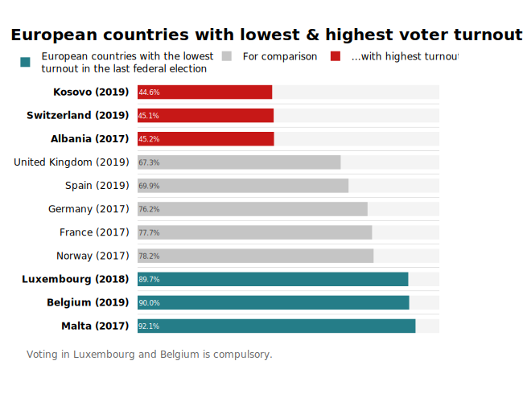

Recreating some of the plots on [datawrapper.de](datawrapper.de). And experiment to learn what it takes to make professional publication-quality charts using everyday open-source plotting tools in Python. 

# 

#

